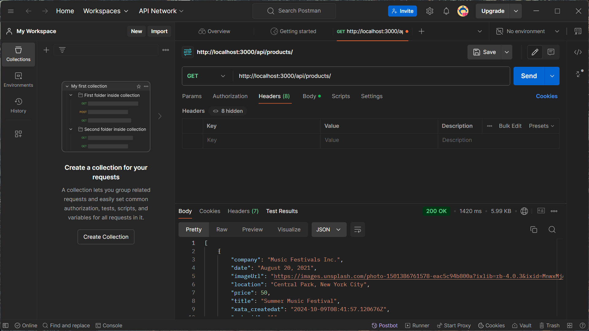
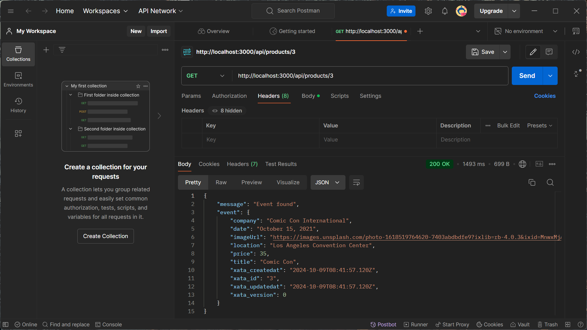
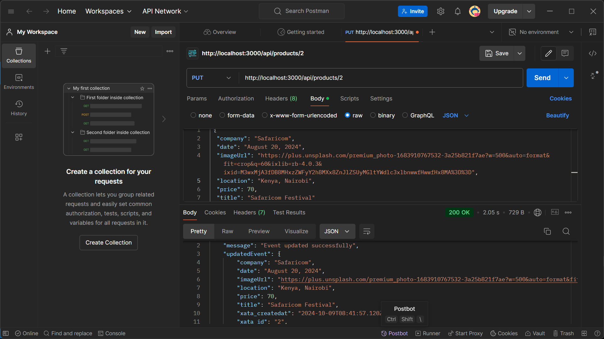
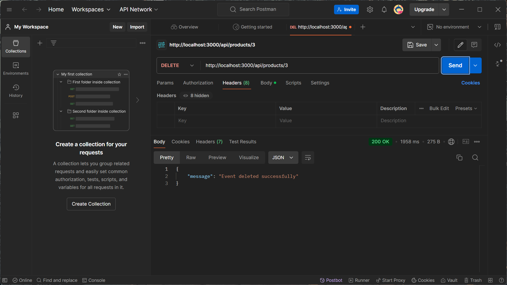

# Event Management API

This project is an Event Management API that allows users to create, read, update, and delete event information. The API is built using Node.js and uses Xata as the database to perform CRUD operations. It can be tested using Postman.

## Features

- Create new events
- Retrieve all events
- Retrieve a specific event by ID
- Update existing events
- Delete events
- Xata database integration for efficient data management

## API Endpoints

- GET `/api/products/`: Retrieve all events
- GET `/api/products/:id`: Retrieve a specific event by ID
- POST `/api/products/`: Create a new event
- PUT `/api/products/:id`: Update an existing event
- DELETE `/api/products/:id`: Delete an event

## Technology Stack

- Node.js
- Express.js
- Typescript
- Xata (database)

## Setup and Installation

1. Clone the repository to your local machine.
2. Navigate to the project directory.
3. Install dependencies by running:
   ```
   npm install
   ```
4. Set up Xata:
   - Sign up for a Xata account if you haven't already.
   - Create a new database for this project.
   - Configure your Xata credentials in the project (refer to Xata documentation for details).
5. Start the server:
   ```
   npm start
   ```
   The server should now be running on `http://localhost:3000`.

## Testing with Postman

You can use Postman to test the API endpoints. Here are some example operations:

### Retrieve All Events


Send a GET request to `http://localhost:3000/api/products/`

### Retrieve Specific Event


Send a GET request to `http://localhost:3000/api/products/3`

### Update Event


Send a PUT request to `http://localhost:3000/api/products/2` with the updated event data in the request body.

### Delete Event


Send a DELETE request to `http://localhost:3000/api/products/3`

## Response Format

The API returns responses in JSON format. Successful operations will return a 200 OK status code along with relevant data or a success message.

## Error Handling

If an error occurs, the API will return an appropriate HTTP status code along with an error message in the response body.

## Database Schema

The Xata database schema for events likely includes fields such as:
- company
- date
- imageUrl
- location
- price
- title
- xata_createdAt
- xata_id
- xata_version

Refer to your Xata database configuration for the exact schema details.

## Contributing

Please read CONTRIBUTING.md for details on our code of conduct, and the process for submitting pull requests to us.

## License

This project is licensed under the MIT License - see the LICENSE.md file for details.
