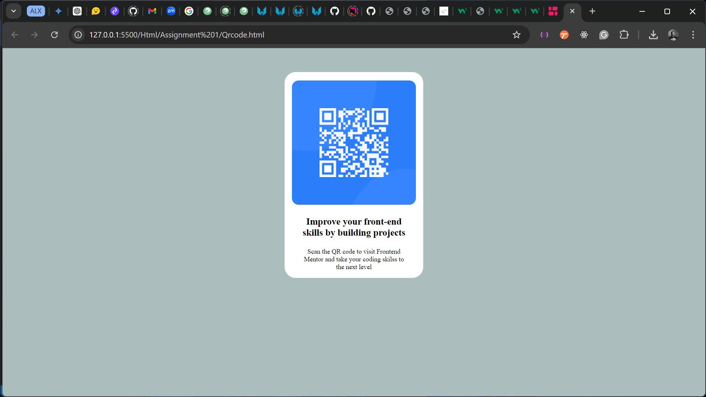
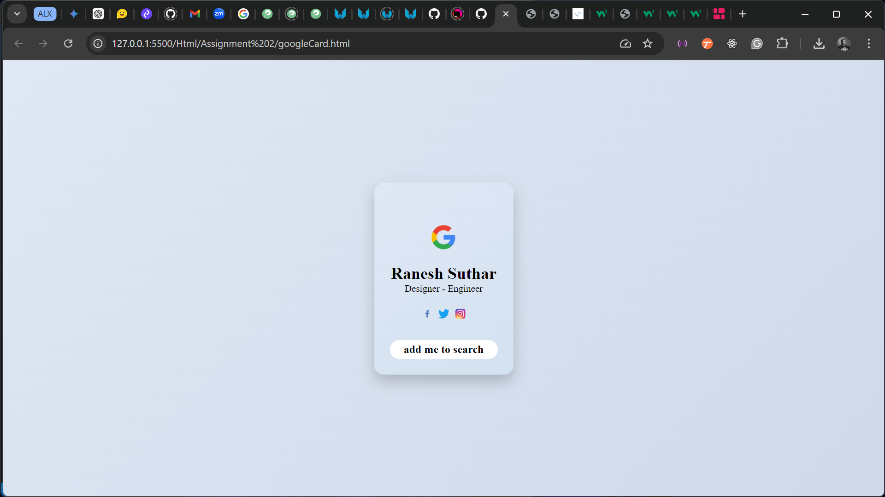
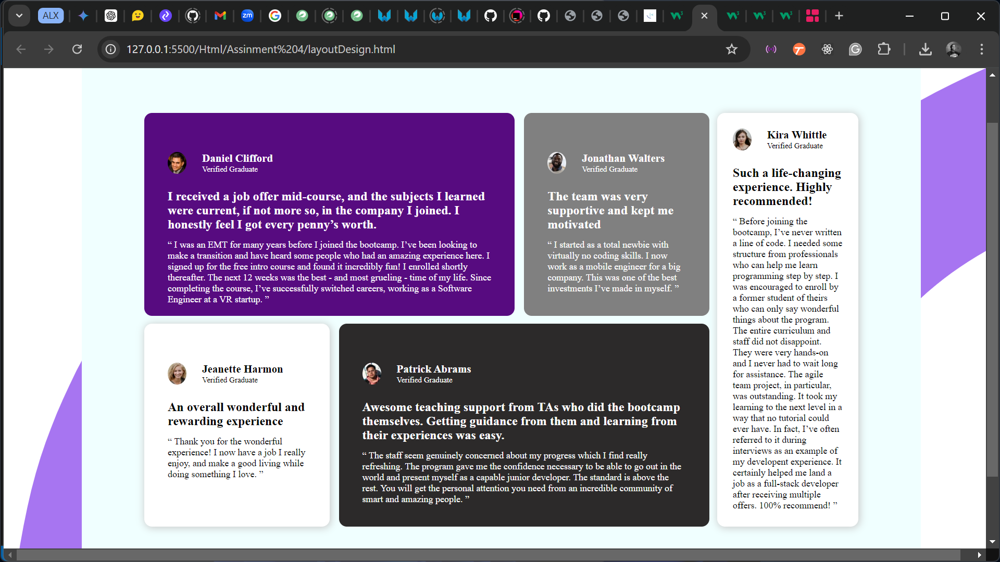
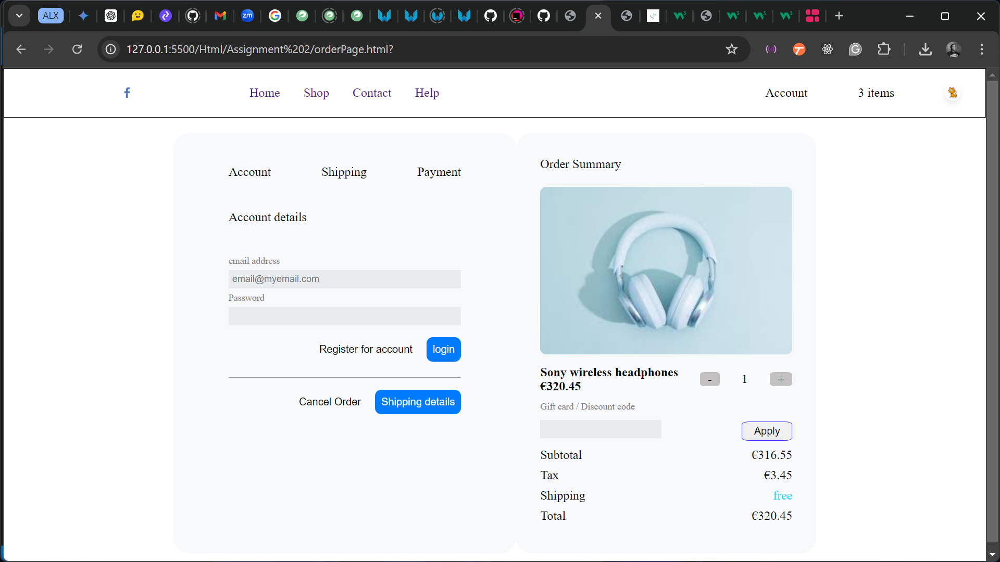
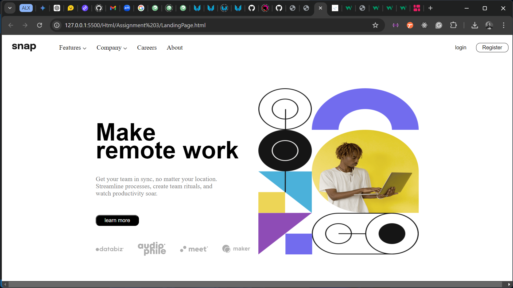

# HTML and CSS Projects

Welcome to my repository containing various projects built using **HTML** and **CSS** only. These projects demonstrate different layouts, components, and styles implemented using pure HTML and CSS techniques.

---

## Table of Contents

1. [About the Projects](#about-the-projects)
2. [List of Projects](#list-of-projects)

---

## About the Projects

This repository is a collection of front-end projects designed to enhance my skills in HTML and CSS. The projects cover a variety of layouts, components, and design patterns that demonstrate my understanding of responsive design, grid systems, Flexbox, and CSS animations.

---

## List of Projects

1. **Project 1: QR code web page**
   
   
2. **Project 2: google card web page**
   
   
3. **Project 3: Responsive Grid Layout**
   

4. **Project 4: Order page**
   

5. **Project 4: Landing page**
   